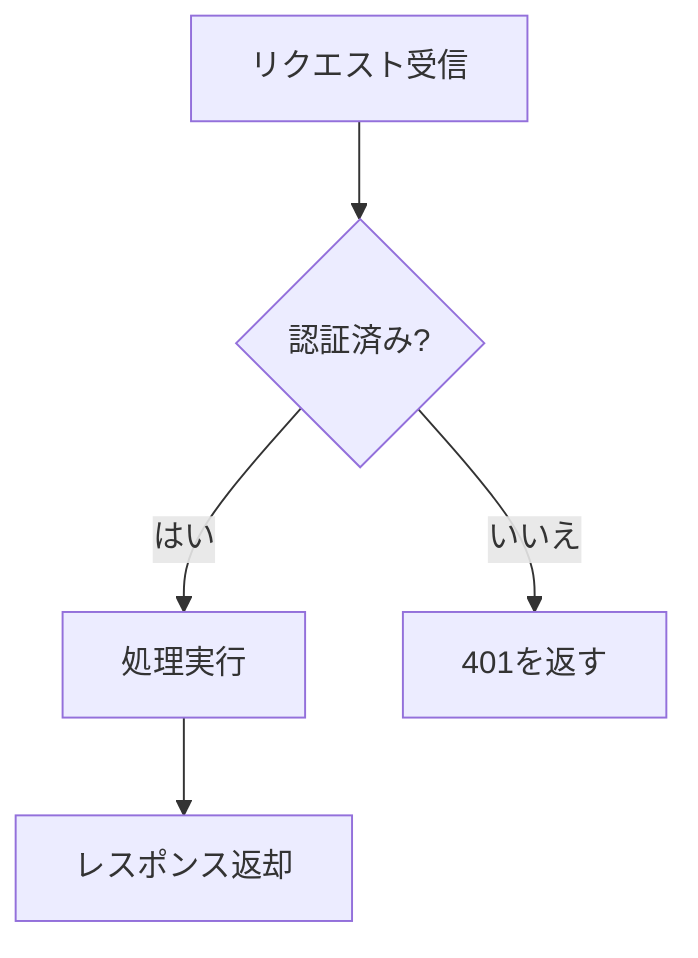

# 設計ドキュメント: 通知システム

本ドキュメントは通知システムの設計概要です。

## 目的

ユーザーに**重要なイベント**を遅延なく届ける。

- メール通知
- プッシュ通知
  - iOS
  - Android
- アプリ内通知

## アーキテクチャ

| コンポーネント | 役割 |
|---|---|
| Producer | イベント発行 |
| Queue | バッファリング |
| Worker | 配信処理 |

設定例:

```yaml
notifications:
  retry: 3
  timeout: 30
```

> 注意: レート制限は別途検討が必要。

詳細は [API仕様](https://example.com/api) を参照。

## フロー図


